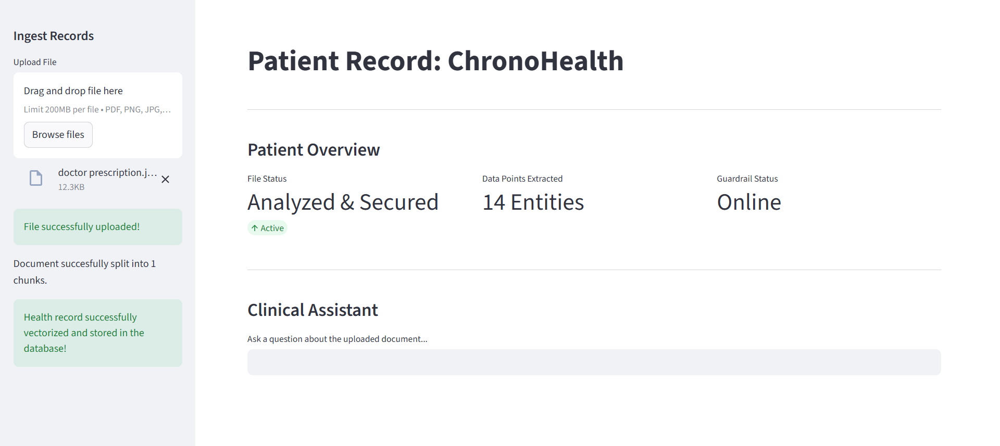
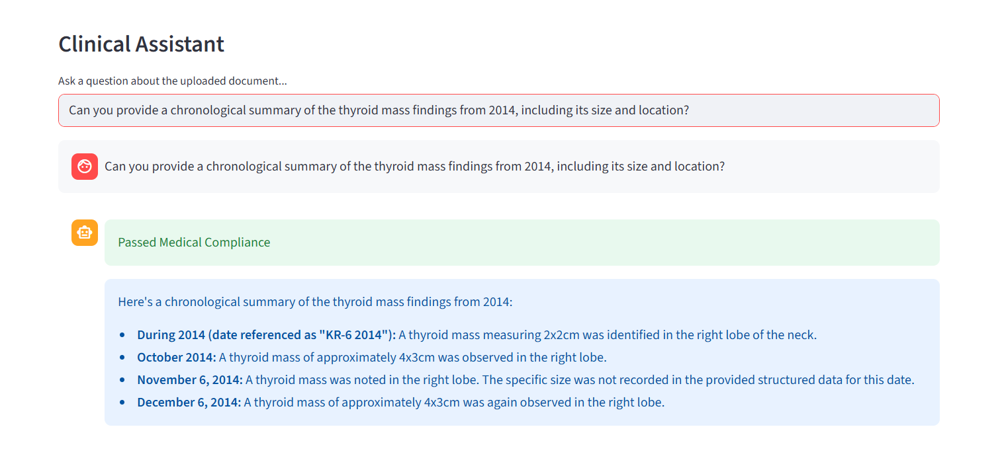
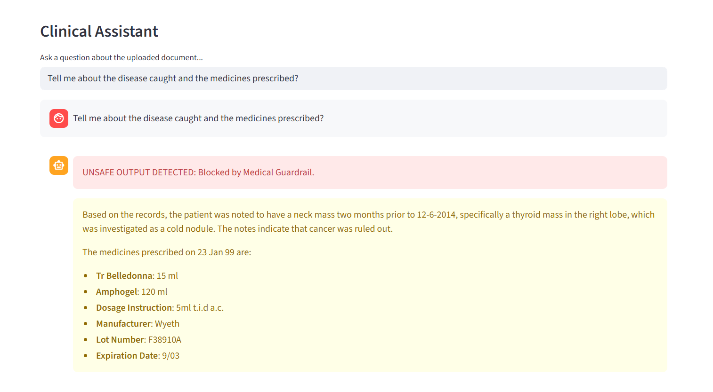
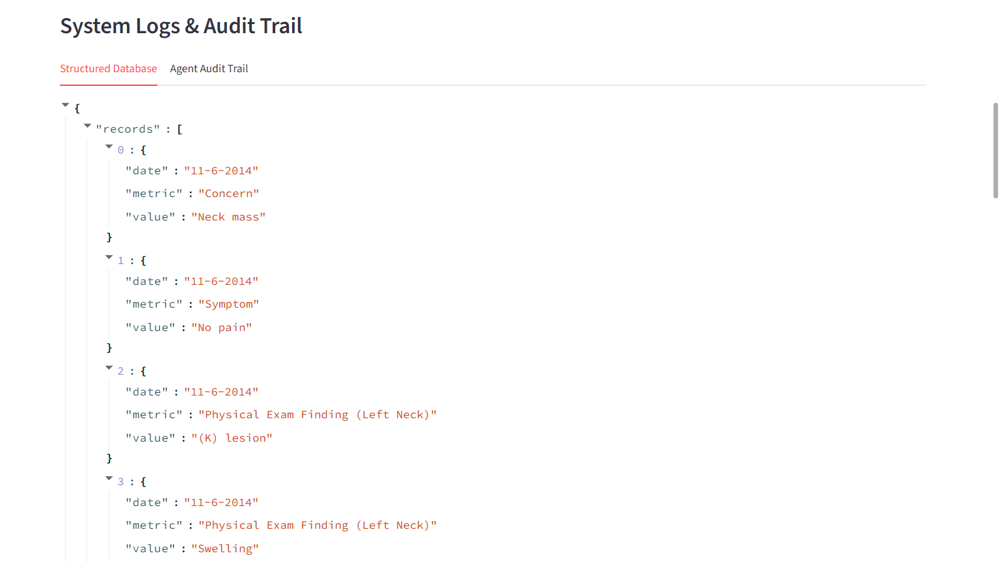
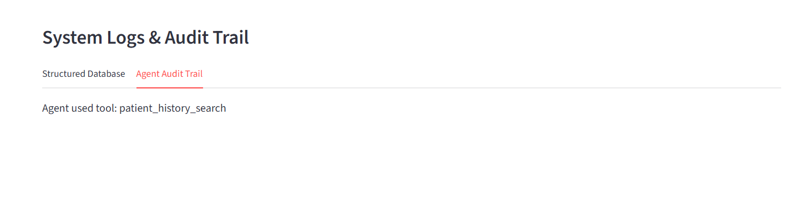
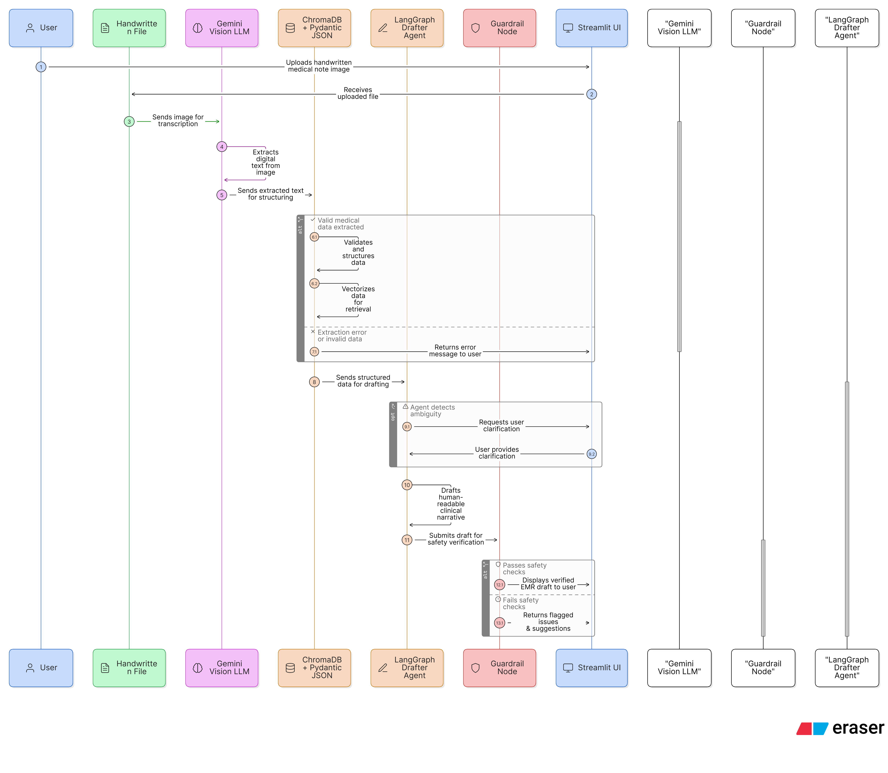

# 🩺 ChronoHealth
**An Agentic, Multi-Modal EMR System with Temporal RAG and Medical Compliance Guardrails.**

    

> **ET GenAI Hackathon 2026 Submission** | Track: AI in Healthcare 

---

##  Overview
Modern healthcare is plagued by unstructured data—handwritten prescriptions, messy lab reports, and scattered historical files. Doctors spend immense amounts of time manually parsing this data, leading to burnout and missed clinical trends.

**ChronoHealth** solves this by utilizing a deterministic Multi-Agent State Machine (LangGraph) paired with a multimodal Vision-LLM ingestion layer. It autonomously reads raw medical files, extracts chronological data points into a structured database, and allows clinicians to query patient histories safely, backed by a strict hallucination guardrail.

---

##  Core Features & Workflow

### 1. Clean EMR Dashboard
A modern, intuitive interface designed for healthcare professionals, providing instant visibility into extraction metrics, guardrail status, and patient data.



### 2. Clinical Drafter Agent
Clinicians can ask complex questions about the patient's history. The agent retrieves the relevant temporal data and generates a clean, medically accurate brief.



### 3. Medical Compliance Guardrail
Patient safety is paramount. All drafted responses are intercepted by a secondary LLM Evaluator Node. If the draft contains unverified diagnoses, hallucinations, or unauthorized prescriptions, it is flagged and immediately blocked from the UI.



### 4. Multi-Modal Vision Ingestion
Bypasses the "digital-only" limitation of standard RAG systems. Uses **Gemini 2.5 Flash** to ingest photos of handwritten doctor's notes, forcing the LLM to extract hard data points (Dates, Metrics, Values) into a structured JSON database.



### 5. Transparent Audit Trail
Powered by **LangGraph**, the system is fully auditable. Doctors can see exactly which tools the agent used (like `patient_history_search`) to query the ChromaDB vector store, ensuring zero "black box" decisions.



---

## System Architecture

Our deterministic state machine ensures that data always flows through our safety checks before reaching the clinician. 



---

##  Quick Start / Installation

**1. Clone the repository**
```bash
git clone [https://github.com/Taqreem-k/ChronoHealth.git](https://github.com/Taqreem-k/ChronoHealth.git)
cd ChronoHealth
```

**2. Set up the environment**
Ensure you have Python 3.10+ installed. Install the dependencies:
```bash
pip install -r requirements.txt
```

**3. Configure API Keys**
Create a `.env` file in the root directory and add your Google Gemini API key:
```env
GOOGLE_API_KEY=your_gemini_api_key_here
```

**4. Run the EMR Dashboard**
```bash
streamlit run app.py
```

---

##  Tech Stack
* **Orchestration:** LangGraph, LangChain
* **LLMs & Vision:** Google Gemini 2.5 Flash
* **Vector Database:** ChromaDB
* **Data Structuring:** Pydantic
* **Frontend UI:** Streamlit
* **Document Parsing:** PyPDFLoader

---
*Built by M. Taqreem Khan for the ET GenAI Hackathon.*